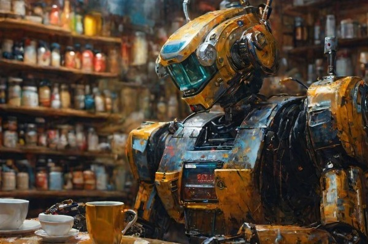
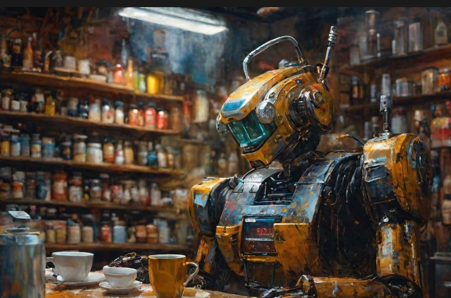
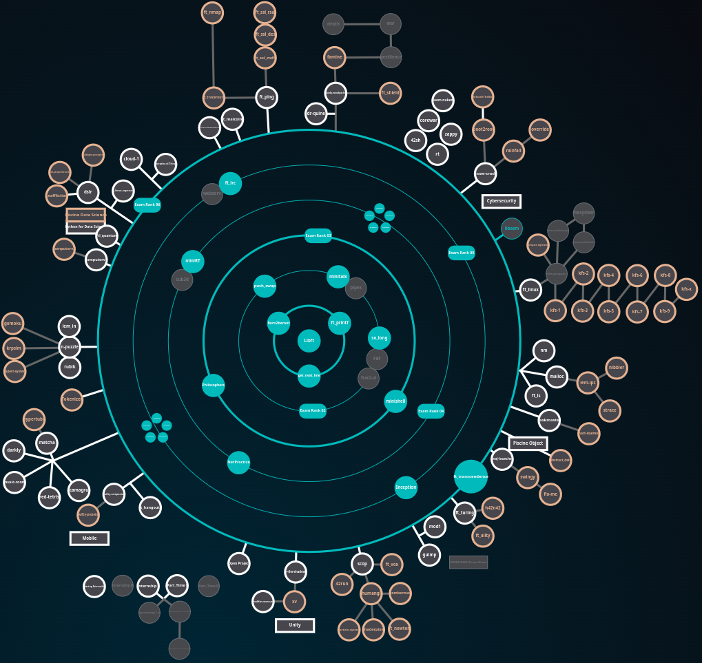

<h1 align="center"><b>Hi there, I'm Sadettin - sfidan42 </b></h1>

# My GitHub Overview
| [DigitalGate Projects](https://github.com/sfidan42/Holy_DigitalGate_Project) | [Game Engine - Engine42](https://github.com/sfidan42/Engine42) | [My Linux Configs](https://github.com/sfidan42/linux_configs) |

## 42 Istanbul projects (All are private and written mostly in C)
0) **libft**: libc functions' library. DIY
1) **ft_printf**: the printf function itself
2) **get_next_line**: Read one file line with static variable. Similar to readline function.
3) **push_swap**: Sorting integer numbers (radix sort) in stack structure.
4) **minitalk**: send data between terminals using UNIX signals (SIGUSR1, SUGUSR2)
5) **so_long**: A 2D game from scratch
6) **minishell**: A small but not easy UNIX Shell. Similar to bash. DIY
7) **philosophers**: Dining philosophers problem using threads and mutexes
8) **Cpp Modules 00-04**: Cpp Beginner but not easy
9) **Netpractice**: Networking exercise
10) **miniRT**: A raytracing project from scratch
11) **Cpp Modules 05-09**: Advance in C++
12) **ft_irc**: IRC server written in C++
13) **Inception**: Docker with nginx, wordpress, mariaDB
14) **Transcendence**: PONG game with pure js, postgreSQL, python django
### Specialization
- I) [**libasm**](https://github.com/sfidan42/42_I_libasm/tree/macos): intel x86_64 nasm assembly.
- II) [**computorv1**](https://github.com/sfidan42/42_II_computorv1): C++ program to solve 2nd order polynomials
- III) [**dr-quine**](https://github.com/sfidan42/42_III_dr-quine): self-producing programs
- IV) [**ft_linear_regression**](https://github.com/sfidan42/42_IV_ft_linear_regression): a simple linear regression
- V) [**scop**](https://github.com/sfidan42/42_V_scop): C++ and OpenGL to render an .obj file
- VI) [**ftl_quantum**](https://github.com/sfidan42/42_VI_ftl_quantum): quantum circuits simulation using python and Qiskit

|  |  |
|---|---|

## Github Stats
|  |  |
|---|---|

### Others
- vec3 library in C
    - [C vec3](https://github.com/sfidan42/vec3-library-diy)
- Python Projects:
    - [Hangman Game](https://github.com/sfidan42/Hangman-Game)
- Matlab Projects:
    - [Covid-App](https://github.com/sfidan42/Covid-19-Visualizer)
- My Phonebook application
    - [phonebook-api](https://github.com/sfidan42/Phonebook-API): .Net Core (C#)
    - [phonebook-app](https://github.com/sfidan42/Phonebook-APP): Angular Fr.
- My First Codes
     - [Follow the link, please.](https://github.com/sfidan42/My-First-Codes)

